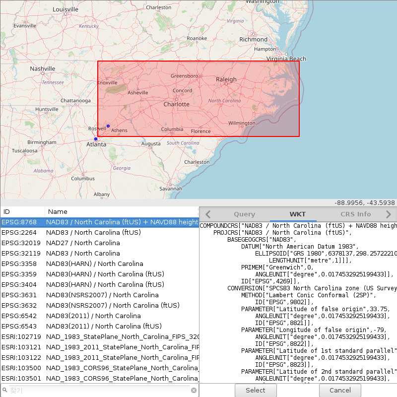

Introduction
============

The want or the need?
---------------------

It all started with `one GRASS GIS feature request <https://github.com/OSGeo/grass/issues/1253>`_ that I posted back on January 15, 2021.
The idea was to be able to select a coordinate reference system (CRS) for our data visually, not by keywords or projection names about which we may have very little or even no clue when we start a new study.
This figure shows the idea very well.

.. figure:: images/works-want.png
   :align: center
   :width: 75%
   :alt: Forward (works) and reverse (want) queries of coordinate reference systems

   Forward (works) and reverse (want) queries of coordinate reference systems

Simply put, it was about reverse search of CRSs starting from the map instead of going through a long list of CRSs and trying them one by one until we find the right CRS for our study area.

Do we need it?
Maybe not if you are patient and have time for checking different CRSs, but do we want it?
Definitely yes and my ultimate goal was to create software that no GIS users can live without once they learned how useful it is.

ProjPicker
----------

`ProjPicker <https://github.com/HuidaeCho/projpicker>`_ is a Python module that allows the user to select CRSs spatially on a map and provides set-theoretic operators so that s/he can filter out unnecessary projections efficiently.
It uses `OpenStreetMap <https://www.openstreetmap.org/>`_ for displaying a basemap for geospatial referencing as shown in this figure.

   Finding CRSs for UNG and Atlanta, Gerogia

It consists of four components:

* module for use in other Python scripts
* standalone executable
* web server
* web client

Sponsor
^^^^^^^

This project was funded by `the Institute for Environmental and Spatial Analysis <https://ung.edu/institute-environmental-spatial-analysis/>`_ (IESA) at `the University of North Georgia <https://ung.edu/>`_ (UNG).

License
^^^^^^^

Copyright (C) 2021 `Huidae Cho <https://faculty.ung.edu/hcho/>`_ and `Owen Smith <https://www.gaderian.io/>`_

This program is free software: you can redistribute it and/or modify it under the terms of the GNU General Public License as published by the Free Software Foundation, either version 3 of the License, or (at your option) any later version.

This program is distributed in the hope that it will be useful, but WITHOUT ANY WARRANTY; without even the implied warranty of MERCHANTABILITY or FITNESS FOR A PARTICULAR PURPOSE.
See the GNU General Public License for more details.

You should have received a copy of the GNU General Public License along with this program.
If not, see <https://www.gnu.org/licenses/>.

What can you do with it?
------------------------

The most important task that ProjPicker helps you with is spatial query of CRSs on a map.
You can draw geometries including points, polygons, and boxes to represent your study area and query CRSs that contain or exclude these geometries.
There are four query modes including ``and``, ``or``, ``xor``, and ``postfix``.
The ``postfix`` mode provides the most advanced syntax for querying.
After CRSs are queried, you can filter them using a very flexible filtering capability.
Once you found a right CRS, you can copy its well-known text (WKT) or refer to its `EPSG <https://epsg.io/>`_ ID.

Another very useful feature is coordinate matching.
Sometimes geospatial data misses the most critical piece of its metadata.
What is it?
Yes, it is its CRS or projection information.
Without this critical information, it is just not possible to properly map your data at the right place in a GIS.
ProjPicker provides a tool that takes pairs of latitudes and longitudes of known locations and their unknown units in an unknown CRS.
It can find the CRSs that match your data within a given tolerance in the same unknown units.

References
----------

`ProjPicker GitHub repository <https://github.com/HuidaeCho/projpicker>`_

`ProjPicker PyPI page <https://pypi.org/project/projpicker/>`_

`ProjPicker documentation <https://projpicker.readthedocs.io/>`_

`ProjPicker Web <https://projpicker.pythonanywhere.com/>`_

`GRASS GIS integration 1/2 <https://github.com/OSGeo/grass/pull/1770>`_

`GRASS GIS integration 2/2 <https://github.com/OSGeo/grass/pull/1891>`_
